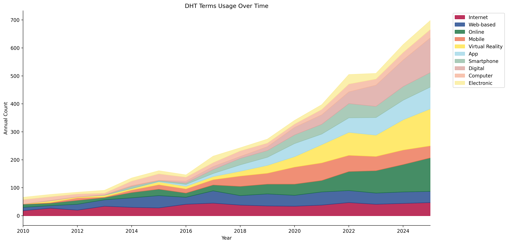
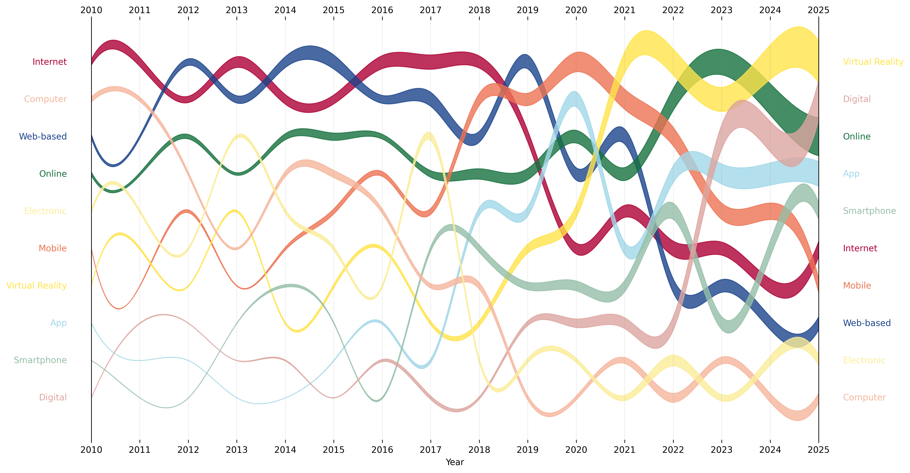

# DHT Terms Utility Tools

A Python-based tool for analyzing and visualizing the usage trends of Digital Health Technology (DHT) terms over time. This project consists of two main components: a PubMed abstract fetcher and a streamgraph visualization tool.

## PubMed Abstract Fetcher (`fetch.py`)

### Features

-   **Abstract Retrieval**
    -   Automated DOI-based abstract retrieval
    -   Batch processing capability
    -   Local storage of fetched abstracts

### Usage

```python
from fetch import fetch_abstract

# Fetch a single abstract
abstract = fetch_abstract(doi="your-doi-here")

# The abstract will be saved automatically to the abstracts_auto_2 directory
```

### Output

Abstracts are saved as text files in the `abstracts_auto_2` directory, with filenames based on the DOI (replacing '/' with '\_').

## Streamgraph Visualization (`streamgraph.py`)

### Features

-   **Basic Streamgraph Generation**

    -   Stacked and unstacked visualization options
    -   Custom color palette for consistent branding
    -   Automated legend and axis labeling

-   **Advanced Streamgraph Visualization**

    -   Smooth curve interpolation
    -   Ranked term positioning
    -   Dynamic term labels at timeline endpoints
    -   Customizable vertical spacing

### Usage

```python
import pandas as pd
from streamgraph import create_basic_streamgraph, create_fancy_streamgraph

# Read your data
df = pd.read_csv("input_csv_file")

# Create basic streamgraph
create_basic_streamgraph(df, stacked=True)

# Create fancy streamgraph with ranking
create_fancy_streamgraph(df, rank=True)
```

### Input Data Format

The visualization expects a CSV file with the following structure:

-   First column: "Year"
-   Subsequent columns: Term names with their annual counts

### Output Files

The tool generates high-resolution PNG files:

-   `streamgraph_basic_stacked.png` or `streamgraph_basic_unstacked.png`
-   `streamgraph_fancy_ranked.png` or `streamgraph_fancy_unranked.png`

### Example Visualizations

#### Basic Stacked Streamgraph



#### Fancy Ranked Streamgraph



### Color Palette

The visualization uses a custom color palette:

-   Deep Red (#AD0034)
-   Dark Blue (#1B448B)
-   Dark Green (#16713E)
-   Bright Orange (#ED7353)
-   Bright Yellow (#FFE44A)

## License

## Contact
